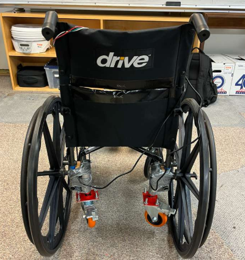

# Daemon - Treehacks Hackathon Project 2026
## Description

The Core Idea: 
Daemon lets AI learn what its body parts are and how to use them.
You attach a new arm.
Instead of hardcoding support for it, the AI begins exploring:
“Oh, this rotates.”
“This joint moves up and down.”
“This closes.”
“If I close this around something, I can grab it.”
It builds an internal model of what it can do.
Not because we wrote special case logic.
But because it tried, failed, adjusted, and learned.

How it works: 

Let’s say you tell the robot:
“Go pick up that banana.”

The AI understands the goal. 
But it doesn’t automatically know how to use the arm perfectly.
So it experiments.
It drives forward. Too far. Adjusts.
It lowers the arm. Misses. Tries again.
It grips too early. Drops it. Learns.

You point your laptop camera at the robot while it practices. That visual feedback becomes the signal that tells it whether it succeeded or failed.

It keeps iterating.
And here’s the part we love:
You can leave. Go grab dinner.
Come back a few hours later.
Now the robot can pick up the banana.

You didn’t write new motor logic.
You didn’t rewrite the firmware stack.
You didn’t manually calibrate every joint.

It learned how to use its new arm.

What makes this different: 

Normally, hardware integration is rigid. Static. Painful.
With Daemon:
Adding a new part isn’t a rewrite.
It’s a capability to be discovered.

We separate the system into layers:
The AI decides what it wants to do.
Daemon handles safe execution and learning.
The hardware simply exposes what it can physically do.

That separation is what makes adaptation possible.

How we did it: 

1. Firmware to DAEMON interface (daemon-cli)
Manufacturers annotate existing firmware APIs, and daemon-cli generates a standardized DAEMON manifest + runtime wrapper.

2. Node discovery and capability exposure
Each hardware module (base, arm, camera, etc.) exposes its commands and telemetry as a DAEMON node over serial/TCP.

3. Natural-language control from desktop-app
Users connect devices and type goals in plain English. They do not need to manually map commands to components.

4. Planning + orchestration
The planner converts user intent into structured action steps, and orchestrator validates, routes, and executes those steps across one or more nodes safely.

5. Closed-loop autonomy (autonomy-engine)
The autonomy loop uses live camera frames plus an OpenAI-based critic to run an execute → evaluate → adjust cycle.
It updates control parameters between attempts and stops when success is stable (for example, 2 consecutive successful iterations).

6. End result
DAEMON turns heterogeneous firmware and hardware into one AI-operable system, enabling multi-device behavior without custom per-device orchestration logic.

Github repository: https://github.com/Sachin-dot-py/Daemon
