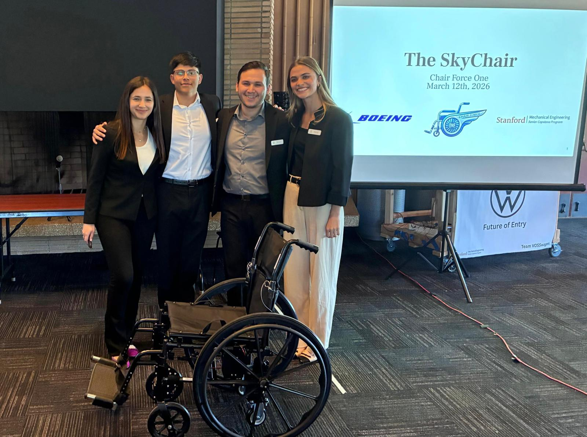

# The Airplane Accessibility Entry Project with Boeing
## Description

One in eight American adults lives with a mobility impairment, yet current airline boarding procedures require passengers to transfer between multiple chairs before reaching their seat — reducing independence and increasing the risk of wheelchair damage. Working with Boeing, our team designed and built a travel wheelchair that converts to fit within the 18-inch aisle of a commercial aircraft using a linear-actuated wheel deployment system, and folds compactly to fit in an overhead bin, eliminating the need to check the wheelchair into cargo entirely.

My Contributions:

- Specified the linear actuators and compatible closed-loop controller to meet lift and precision requirements
- Designed and built the wiring system, including soldering the switch connections
- Specified the battery based on power and capacity requirements
- Designed and fabricated the controller mount and battery mount
- Led the radial-load testing of the linear actuators to validate safe deflection under load
  

[View full report (PDF)](../images/ME170A - Chair Force One - Q1 Report.docx.pdf)

