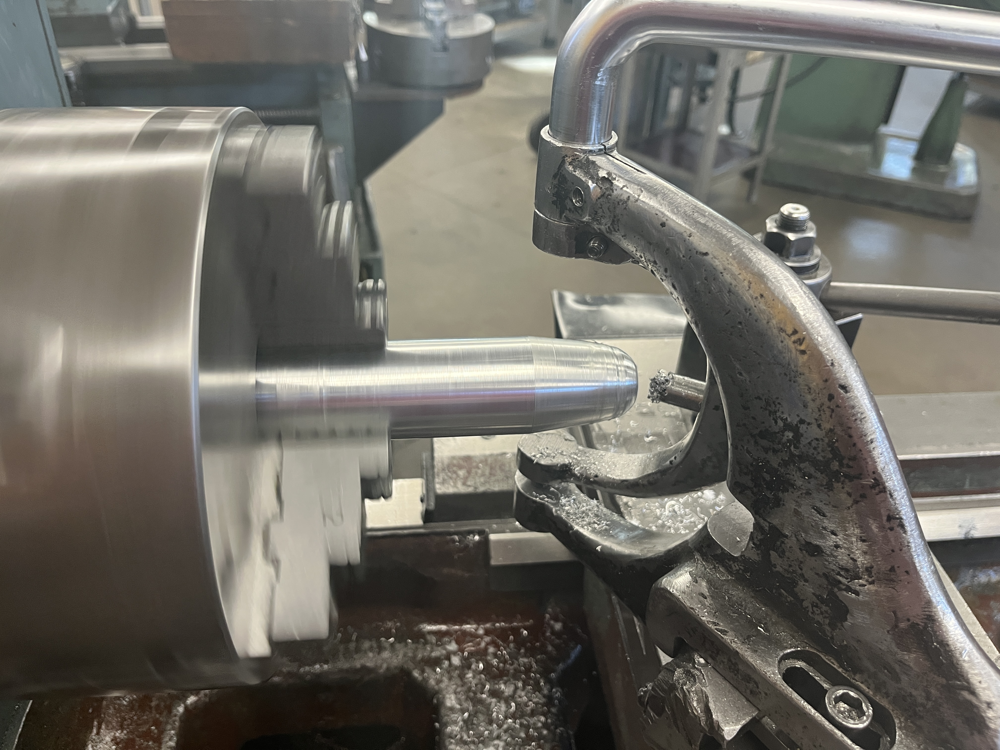
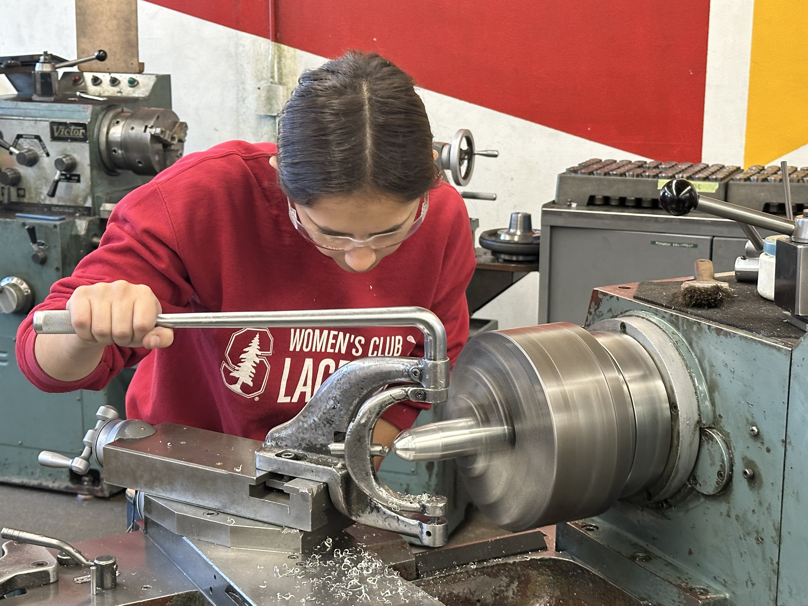
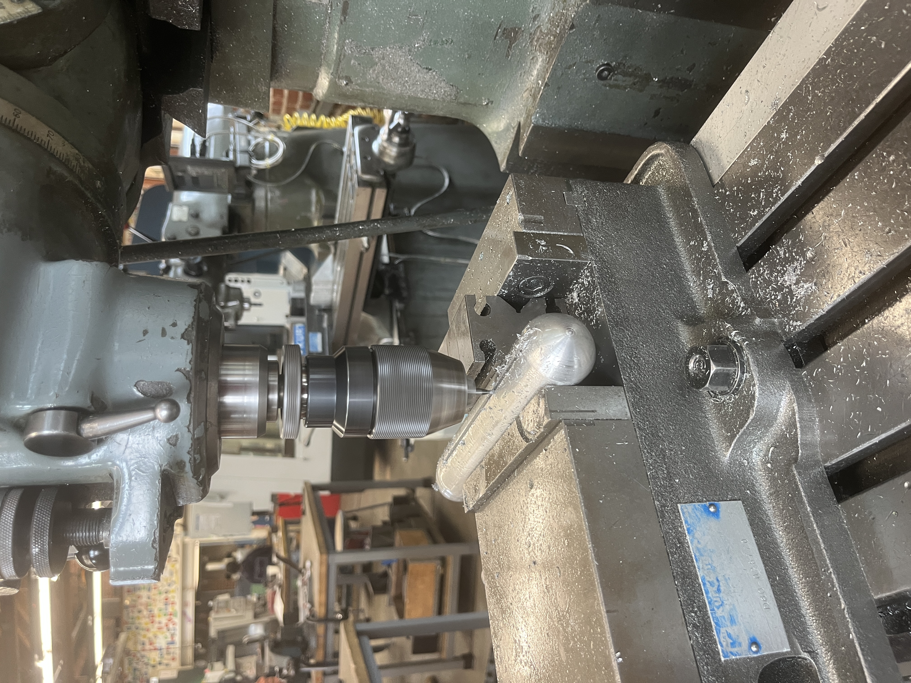
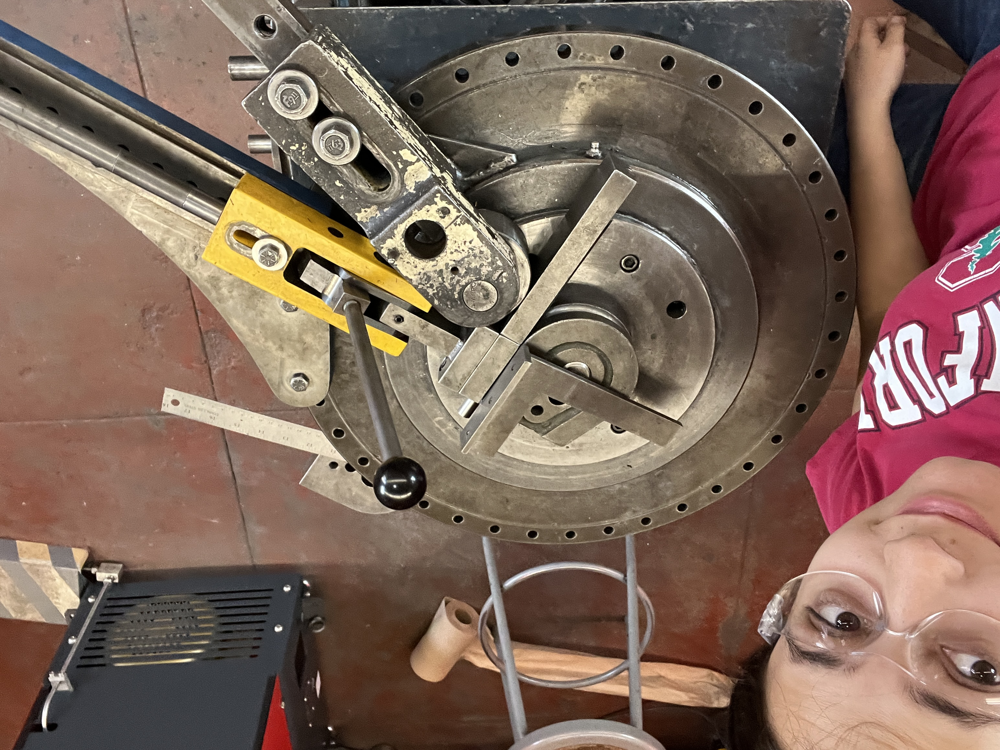
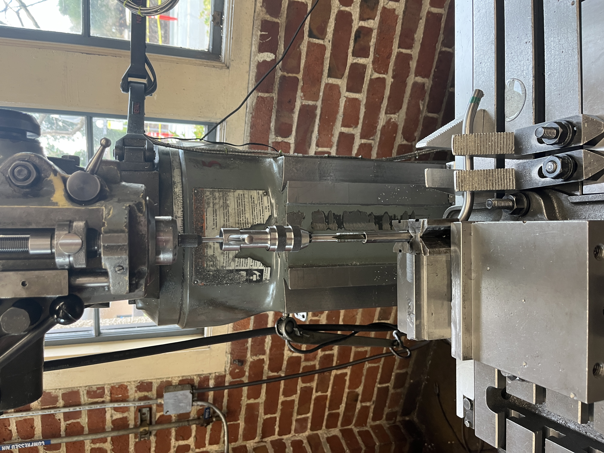

# Volare - The NASA Boeing X-36 Tailless Fighter Aircraft

I designed and manufactured a scale model of the NASA Boeing X-36 Tailless Fighter Aircraft: an experimental prototype known for its exceptional agility and unconventional aerodynamic layout. The X-36, which completed a 31-flight research program in 1997, was engineered to fly without the traditional vertical tail found on most jets. Instead, it relied on a forward canard, split ailerons, and an advanced thrust-vectoring nozzle for directional control. Its bold, boundary-pushing design reflects the type of innovation that inspires my own interest in aerospace engineering, making it an ideal choice for this project.

To build the model, I used a combination of precision machining and fabrication techniques. On the lathe, I used a radius cutter to shape the aircraft’s nose, ensuring a smooth, aerodynamic contour. I also tapped holes and threaded tubes that I later connected to the display stand. Using the mill, I cut the slots needed to mount the wings, and I fabricated the wing components themselves using a waterjet cutter for clean, accurate profiles. Tube-bending methods were used to shape the supporting structure, and additional features were machined on both the lathe and mill to achieve the final assembly.

Overall, this project allowed me to combine my passion for aerospace engineering with hands-on manufacturing experience, resulting in a detailed representation of one of NASA’s most innovative tailless aircraft designs.

  
  
  
  
  
  

