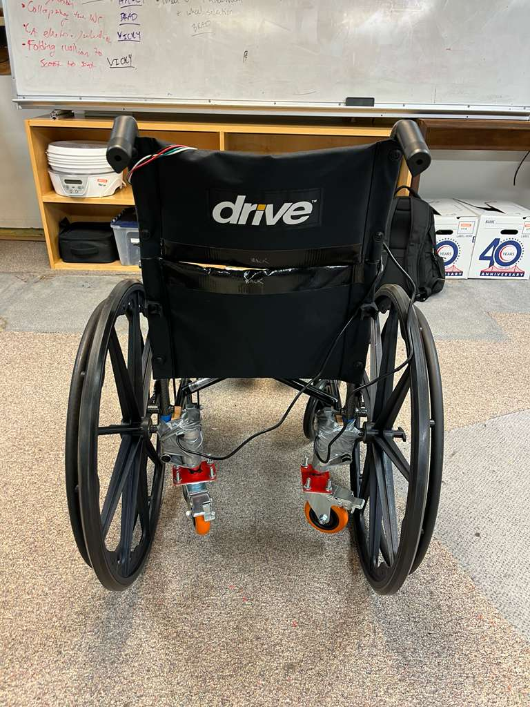

# Thermodynamics of a 1D Hypersonic Flow Path through a hypersonic jet

This project focused on a comprehensive one-dimensional flow-path analysis of a hypersonic propulsion system, applying advanced thermodynamic and compressible flow principles. The analysis was structured into six distinct regions, encompassing a converging inlet nozzle with shock formation, a shock train, a combustion chamber, and a diverging exhaust nozzle, capturing the key flow phenomena governing hypersonic engine performance.

