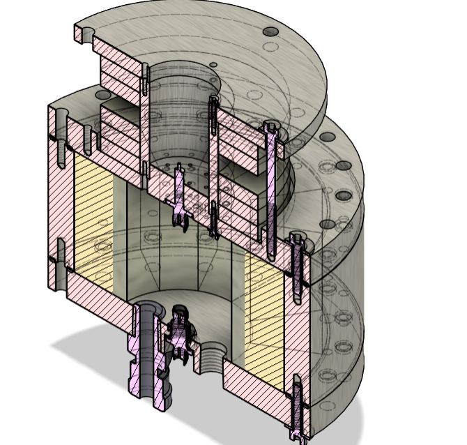

# Electron Cyclotron Resonance Thruster 

## Description
An electron cyclotron resonance (ECR) thruster is a type of electric propulsion device that generates plasma by heating electrons through resonant interaction with a microwave-frequency electromagnetic field in the presence of a static magnetic field. When the electron cyclotron frequency set by the magnetic field matches the microwave frequency, electrons efficiently absorb energy from the oscillating electric field of the microwave. These energized electrons collide with neutral propellant atoms, ionizing them and sustaining a plasma. Because plasma generation relies on resonance rather than electrode-based discharges, ECR thrusters avoid direct electrode erosion and can operate stably at low propellant flow rates.

This project, conducted with the Stanford Plasma Physics Lab, focused on the design and development of an ECR thruster. My individual contribution centered on the design of the gas injection backplate, which controls how neutral propellant is introduced into the plasma chamber surrounding a central magnetic rod. I developed a MATLAB script to size and parameterize the backplate orifice geometry, including the number of holes, their diameters, and spatial layout. The script enabled systematic exploration of gas conductance and spatial distribution, allowing rapid iteration of backplate designs while maintaining mechanical constraints. This was important because the gas injection geometry directly influences chamber pressure, plasma uniformity, and ionization stability.

